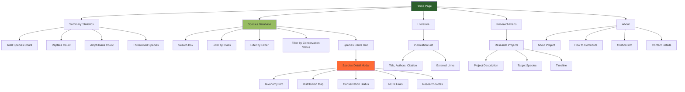
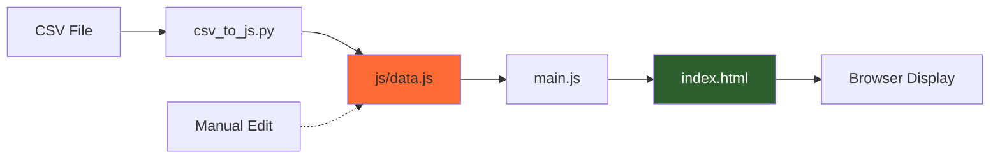
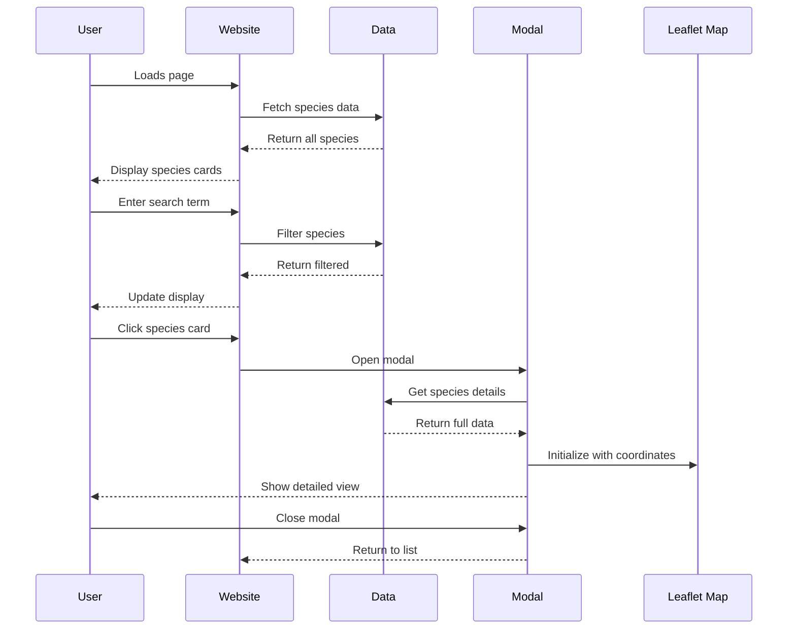

# Site Structure Diagram

```mermaid
graph TD
    A[Home Page] --> B[Summary Statistics]
    A --> C[Species Database]
    A --> D[Literature]
    A --> E[Research Plans]
    A --> F[About]
    
    B --> B1[Total Species Count]
    B --> B2[Reptiles Count]
    B --> B3[Amphibians Count]
    B --> B4[Threatened Species]
    
    C --> C1[Search Box]
    C --> C2[Filter by Class]
    C --> C3[Filter by Order]
    C --> C4[Filter by Conservation Status]
    C --> C5[Species Cards Grid]
    
    C5 --> C6[Species Detail Modal]
    C6 --> C7[Taxonomy Info]
    C6 --> C8[Distribution Map]
    C6 --> C9[Conservation Status]
    C6 --> C10[NCBI Links]
    C6 --> C11[Research Notes]
    
    D --> D1[Publication List]
    D1 --> D2[Title, Authors, Citation]
    D1 --> D3[External Links]
    
    E --> E1[Research Projects]
    E1 --> E2[Project Description]
    E1 --> E3[Target Species]
    E1 --> E4[Timeline]
    
    F --> F1[About Project]
    F --> F2[How to Contribute]
    F --> F3[Citation Info]
    F --> F4[Contact Details]
    
    style A fill:#2c5f2d,color:#fff
    style C fill:#97bc62
    style C6 fill:#ff6b35
```

## Data Flow

```mermaid
graph LR
    A[CSV File] --> B[csv_to_js.py]
    B --> C[js/data.js]
    C --> D[main.js]
    D --> E[index.html]
    E --> F[Browser Display]
    
    G[Manual Edit] -.-> C
    
    style C fill:#ff6b35
    style E fill:#2c5f2d,color:#fff
```

## User Interaction Flow

```mermaid
sequenceDiagram
    participant U as User
    participant W as Website
    participant D as Data
    participant M as Modal
    participant Map as Leaflet Map
    
    U->>W: Loads page
    W->>D: Fetch species data
    D-->>W: Return all species
    W-->>U: Display species cards
    
    U->>W: Enter search term
    W->>D: Filter species
    D-->>W: Return filtered
    W-->>U: Update display
    
    U->>W: Click species card
    W->>M: Open modal
    M->>D: Get species details
    D-->>M: Return full data
    M->>Map: Initialize with coordinates
    M-->>U: Show detailed view
    
    U->>M: Close modal
    M-->>W: Return to list
```
